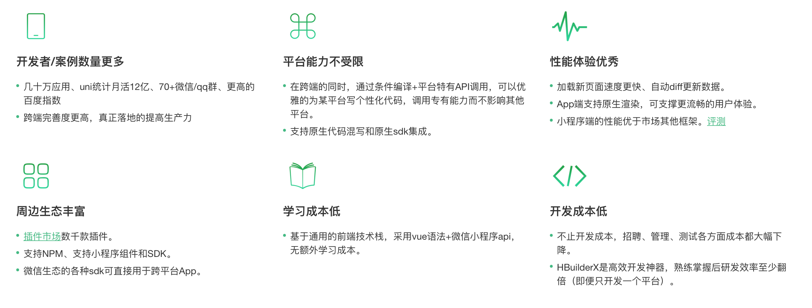

# uni-app

## uni-app简介

### 为什么要学习uni-app

  uni-app在开发者数量、案例、跨端抹平度、扩展灵活性、性能体验、周边生态、学习成本、开发成本等8大关键指标上拥有更强的优势。



### uni-app介绍

  uni-app 是一个使用 Vue.js 开发所有前端应用的框架，开发者编写一套代码，可发布到iOS、Android、Web（响应式）、以及各种小程序（微信/支付宝/百度/头条/QQ/钉钉/淘宝）、快应用等多个平台。

  uni-app在手，做啥都不愁。即使不跨端，uni-app也是更好的小程序开发框架（详见）、更好的App跨平台框架、更方便的H5开发框架。不管领导安排什么样的项目，你都可以快速交付，不需要转换开发思维、不需要更改开发习惯。


## uni-app快速上手

### 开发工具

  1.vscode
  2.微信开发者工具 [https://developers.weixin.qq.com/miniprogram/dev/devtools/devtools.html]

### 开发环境安装

  1.全局安装vue-cli

  ```bash
    npm install -g @vue/cli
  ```

  2.创建uni-app

  ```bash
    vue create -p dcloudio/uni-preset-vue 项目名称
  ```

  3.初次体验建议选择 hello uni-app 项目模板

  .

## 基本使用
